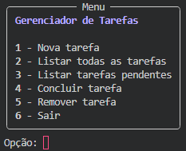
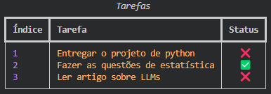

<h1>📝 Gerenciador de Tarefas em Python</h1>
 
 Este repositório contém o projeto desenvolvido para a disciplina <strong>Fundamentos de Programação em Python</strong>, ministrada pelo professor <strong>Denis Martins</strong>, da <strong>PUC Campinas</strong>. 
 
 
 O objetivo principal foi criar um módulo Python personalizado que permita o gerenciamento de tarefas, utilizando conceitos fundamentais da linguagem como <strong>funções, estruturas de dados e modularização</strong>. 

<h2>📂 Conteúdo do Repositório</h2> <ul> 
<li><code>task_manager.py</code> – Módulo com as funções de criação, listagem, conclusão e remoção de tarefas</li> 
<li><code>main.py</code> – Script principal com menu interativo no terminal para uso do gerenciador</li>
 <li><strong>Imagens</strong> – Prints da interface de terminal estilizada com a biblioteca Rich</li> </ul>

<h2>🎯 Funcionalidades</h2>

O módulo <code>task_manager</code> oferece as seguintes funções principais:

<code>create_task(title, description="")</code> - Cria uma nova tarefa

<code>list_tasks()</code> – Lista todas as tarefas 

<code>list_pend_tasks()</code> – Lista todas as tarefas pendentes

<code>mark_complete(task_number)</code> – Marca uma tarefa como concluída

<code>remove_task(task_number)</code> – Remove uma tarefa da lista

<code>select_option(option)</code> – Lida com a escolha do usuário no menu

As tarefas são armazenadas em um dicionário Python com as seguintes informações:

`{
  "Título da Tarefa": {
    "Descrição": "Descrição opcional",
    "Feita": False
  }
}`

<h2>🖥️ Interface do Terminal</h2>

A interface foi estilizada com a biblioteca <strong>Rich</strong>, permitindo uma exibição visualmente agradável no terminal com quadros, tabelas e ícones:

  
  

<h2>💡 Tecnologias Utilizadas</h2>
<strong>Python</strong> (versão 3.10+)

<strong>Rich</strong> – Para estilização do terminal
📦 Instalação: <code>pip install rich</code>

